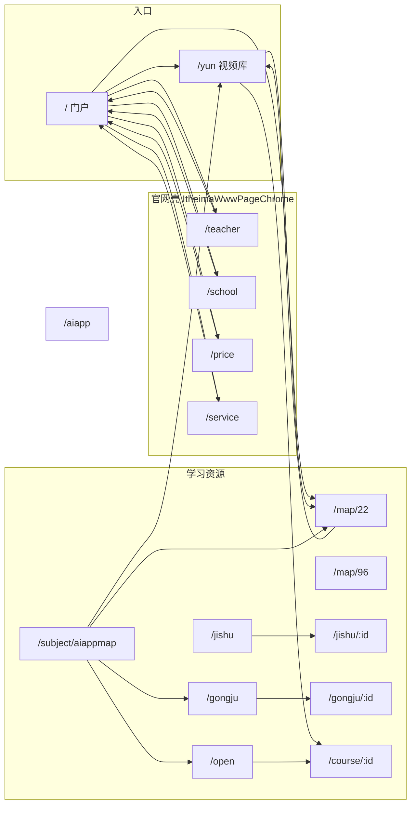

# 白马程序员站内原型 — 页面统计与跳转逻辑

> 本文档汇总「白马程序员内部」Vue 3 项目的**页面数量**、**路由注册**、**站内外跳转关系**及**目录与数据**说明，便于课程大作业交付与答辩说明。  
> 项目物理路径：`大作业/白马程序员内部/`  
> 本地开发默认地址：`http://localhost:5173/`（以 Vite 配置为准）

---

## 一、技术栈与运行方式

| 项 | 说明 |
|----|------|
| 框架 | Vue 3（`<script setup>`） |
| 路由 | Vue Router 4，`createWebHistory` |
| 构建 | Vite 6 |
| 包名 | `baima-itheima-prototype`（`package.json`） |
| 常用命令 | `npm install` → `npm run dev` / `npm run build` / `npm run preview` |

---

## 二、页面数量统计（如何计数）

### 2.1 独立页面视图（Vue 单文件组件 `.vue`）

以下 **16 个**文件各对应一类「可单独成页」的界面（部分通过动态参数 `:id` 生成多个 URL）：

| 序号 | 视图文件 | 路由路径（模式） | 说明 |
|------|-----------|------------------|------|
| 1 | `ItheimaPortalView.vue` | `/` | 官网门户首页（白马品牌、Hero、快捷入口、热门学科卡等） |
| 2 | `HomePrototype.vue` | `/yun` | 视频库首页（yun 风格，含 `SiteHeader`） |
| 3 | `MapPmView.vue` | `/map/96` | 产品经理教程聚合 / 路线图式列表 |
| 4 | `MapJavaView.vue` | `/map/22` | Java / AI 智能应用教程聚合 |
| 5 | `TeacherView.vue` | `/teacher` | 师资力量（套 `ItheimaWwwPageChrome`） |
| 6 | `ItheimaSchoolView.vue` | `/school` | 开班详情 / 全国校区 |
| 7 | `ItheimaPriceView.vue` | `/price` | 学费价格 |
| 8 | `ItheimaServiceView.vue` | `/service` | 就业服务 |
| 9 | `OpenLiveView.vue` | `/open` | 直播公开课列表 |
| 10 | `JishuView.vue` | `/jishu` | 技术文章列表 |
| 11 | `JishuArticleView.vue` | `/jishu/:id` | 技术文章详情（**当前数据 3 篇**） |
| 12 | `GongjuView.vue` | `/gongju` | 学习工具列表 |
| 13 | `GongjuDetailView.vue` | `/gongju/:id` | 工具详情（**当前数据 6 个**） |
| 14 | `CourseDetailView.vue` | `/course/:id` | 视频课程详情（**完整数据主要为 `1002`**） |
| 15 | `AiappLandingView.vue` | `/aiapp` | AI 智能应用培训落地页（可带 `?aiappzly`） |
| 16 | `SubjectAiappmapView.vue` | `/subject/aiappmap` | AI 智能应用学习路线图 |

**小结**：**16 个页面级视图组件**；若按「可访问 URL 条数」统计，则为 **固定路由若干条 + 动态实例条数**（见下）。

### 2.2 路由表（`src/router/index.js`）

- **显式注册的路径**：共 **16 条**有效路由（含 3 条带动态段 `:id`）。  
- **额外重定向**：`/subject/aiappmap/index.html` → `/subject/aiappmap`（**1 条**）。  

### 2.3 动态页面「实例数量」（当前仓库数据）

| 类型 | 路由模式 | 当前数据量 | 示例 URL |
|------|-----------|-------------|----------|
| 技术文章详情 | `/jishu/:id` | **3** | `/jishu/452`、`/jishu/451`、`/jishu/450` |
| 学习工具详情 | `/gongju/:id` | **6** | `/gongju/101` …（见 `src/data/gongjuTools.js`） |
| 课程详情 | `/course/:id` | **主数据 1 套**（`1002`） | `/course/1002`（列表中多处 `courseId: '1002'`） |

**可访问页面粗算**（便于写进报告）：  
固定页 **约 14**（`/yun`、`/map/96`、`/map/22`、`/teacher`、`/school`、`/price`、`/service`、`/open`、`/jishu`、`/gongju`、`/aiapp`、`/subject/aiappmap` 等） + `/` + 动态 **3 + 6** + 课程以 **1** 为主 ≈ **25 个常见可点 URL**；课程路由虽支持任意 `:id`，未配置数据的 id 可能无内容或空态，以实际 `CourseDetailView` 与 `courseDetails.js` 为准。

---

## 三、全局布局与复用组件

| 组件 / 组合 | 用途 |
|-------------|------|
| `App.vue` | 仅挂载 `<RouterView />`，无侧栏布局 |
| `SiteHeader.vue` | 视频库体系统一白顶栏 + 深蓝主导航；品牌链 `/`；`mainNavItems` 来自 `navigation.js`；「培训课程」悬停 Mega 链至 **`TRAINING_LANDING_TO`**（默认 `/aiapp?aiappzly`） |
| `SiteFooter.vue` | 多页底部说明 |
| `ItheimaWwwPageChrome.vue` | 官网子站统一顶栏 + 灰导航（师资 / 开班 / 学费 / 就业）；Logo 回 `/` |
| `PlaceholderImage.vue` | 占位图 |
| `LoginDemoModal.vue` + `useDemoAuth.js` | 门户 `/` 登录演示（本地存储） |
| `SectionTitle.vue` | 部分列表区块标题（如 `HomePrototype`） |

---

## 四、主导航配置（`src/navigation.js`）

### 4.1 `mainNavItems`（用于 `SiteHeader` 深蓝导航）

| 文案 | 行为 |
|------|------|
| 首页 | `RouterLink` → `/` |
| 培训课程 | 无 `to`，悬停展开 Mega；每项卡片链至 **`TRAINING_LANDING_TO`**（站内 `/aiapp?aiappzly`），新标签 |
| 教研团队 | → `/teacher`，新标签 |
| 免费视频教程 | → `/map/22`，新标签 |
| 学习路线图 | → `SUBJECT_AIAPPMAP_TO`（`/subject/aiappmap`），新标签 |
| 直播公开课 | → `/open`，新标签 |
| 技术文章 | → `/jishu`，新标签 |
| 学习工具 | → `/gongju`，新标签 |
| 报考大学 | 外链 `COLLEGE_BUPT_URL`（北京邮电大学官网），新标签 |

### 4.2 其它导出常量

| 常量 | 值 / 含义 |
|------|-----------|
| `TRAINING_CAMPAIGN_URL` | 外站对照落地页（aiapp.itheima.com） |
| `TRAINING_LANDING_TO` | 站内复刻 `/aiapp?aiappzly` |
| `SUBJECT_AIAPPMAP_TO` | `/subject/aiappmap` |
| `COLLEGE_BUPT_URL` | 北邮官网 |
| `trainingMegaMenuItems` | Mega 菜单 15 个大类文案（统一点进同一落地路径） |

---

## 五、站内跳转逻辑分页面说明

### 5.1 门户首页 `/` — `ItheimaPortalView.vue`

- **主导航 `topMenus`**：  
  - 精品课程、免费教程 → `/map/22`（部分 **`blank: true`** 新标签）。  
  - 师资力量 → `/teacher`；开班详情 → `/school`；学费价格 → `/price`；就业服务 → `/service`（多带新标签）。  
  - 报考大学 → 外链 `COLLEGE_BUPT_URL`。  
- **Hero**：进入视频库 → `/yun`（新标签）；教研团队 → `/teacher`（新标签）。  
- **快捷区 `quickLinks`**：就业薪资 `/price`；实战项目 `/map/22`；学员社区、关于白马 → `/yun`。  
- **大课程卡**：师资力量 `/teacher`；课程大纲 `/map/22`（新标签）；「申请免费试听」为按钮（无路由）。  
- **页脚**：链至 `/yun`。

### 5.2 视频库首页 `/yun` — `HomePrototype.vue`

- 使用 **`SiteHeader`**（逻辑见第四节）。  
- 学科分类、路线图等多处 **`RouterLink`** → **`/map/22`**（`MAP_JAVA_ROUTE`）。  
- 直播课、免费课等卡片 → **`/course/${courseId}`**（数据里多为 **`1002`**）。

### 5.3 学习路线图 `/subject/aiappmap` — `SubjectAiappmapView.vue`

- 品牌 → `/`。  
- 视频库首页 → `/yun`；免费视频教程 → `/map/22`；直播公开课 → `/open`；学习工具 → `/gongju`（多新标签）。

### 5.4 Java 聚合 `/map/22` — `MapJavaView.vue`

- 面包屑：首页、视频教程 → `/yun`。  
- 侧栏 / 浮条等 → 本页 `MAP_ROUTE`（即 `/map/22`）或数据内 `to` 字段。

### 5.5 产品经理聚合 `/map/96` — `MapPmView.vue`

- 以静态结构为主（具体链出以模板为准；未单独列出时可视为内容占位页）。

### 5.6 官网子页（师资 / 开班 / 学费 / 就业）

- **`TeacherView`、`ItheimaSchoolView`、`ItheimaPriceView`、`ItheimaServiceView`**：均包在 **`ItheimaWwwPageChrome`** 内；主导航互链 `/teacher`、`/school`、`/price`、`/service`；Logo → `/`。  
- 各页页脚或文案区含 **itheima.com 对照外链**（原站，新标签）。  
- 多页含 **「返回官网首页（原型）」** → **`/`**。

### 5.7 直播公开课 `/open` — `OpenLiveView.vue`

- 列表项 → **`/course/${c.courseId}`**（与数据字段一致，多为 `1002`）。

### 5.8 技术文章 `/jishu` — `JishuView.vue`

- 标题链 → **`/jishu/:id`**。  
- 热门推荐等 → **`/course/1002`**。

### 5.9 文章详情 `/jishu/:id` — `JishuArticleView.vue`

- 面包屑：首页 `/`；视频教程 `/yun`；技术文章 `/jishu`。  
- 上一篇 / 相关阅读 → 其它 **`/jishu/:id`**。  
- 返回列表 → `/jishu`。

### 5.10 学习工具 `/gongju` — `GongjuView.vue`

- 卡片 / 名称 / 查看详情 → **`/gongju/:id`**。

### 5.11 工具详情 `/gongju/:id` — `GongjuDetailView.vue`

- 面包屑：学习工具 → `/gongju`。  
- 相关工具 → 其它 **`/gongju/:id`**。  
- 无数据时 → 提示 + 返回 `/gongju`。

### 5.12 课程详情 `/course/:id` — `CourseDetailView.vue`

- 面包屑视频教程 → `/yun`。  
- 相关课程 → **`/course/${course.id}`**（数据驱动）。  
- 返回视频库 → `/yun`。

### 5.13 AI 落地页 `/aiapp` — `AiappLandingView.vue`

- 页脚：返回门户 **`/`**；外链对照 **`TRAINING_CAMPAIGN_URL`**（新标签）。

---

## 六、跳转关系示意图（Mermaid）



说明：视频库各页通过 **`SiteHeader`** 还可到达 `/`、`/map/22`、`/subject/aiappmap`、`/open`、`/jishu`、`/gongju`、`/teacher` 及培训落地 **`/aiapp?aiappzly`** 等；上图为**主要静态路径**概括。

---

## 七、`src` 目录与数据文件（与页面内容相关）

```
白马程序员内部/src/
├── App.vue
├── main.js
├── style.css                 # 全局样式、CSS 变量
├── router/index.js           # 路由表
├── navigation.js             # SiteHeader 与外链常量
├── components/               # SiteHeader, SiteFooter, ItheimaWwwPageChrome, PlaceholderImage, LoginDemoModal, SectionTitle
├── composables/useDemoAuth.js
├── data/
│   ├── courseDetails.js      # 课程 1002 详情、评论、推荐等
│   ├── jishuArticles.js      # 文章列表 + 详情块
│   └── gongjuTools.js        # 工具列表 + 详情字段
└── views/                    # 上表 16 个页面视图
```

---

## 八、静态与外链资源

| 资源 | 位置 | 说明 |
|------|------|------|
| Logo 位图（若模板引用） | `白马程序员内部/resource/logo.png` | 可按需在组件中改为 `` |
| 外站对照 | 各页 `https://www.itheima.com/...`、`https://yun.itheima.com/...`、`https://aiapp.itheima.com/...` | 用于原型对照，非本站路由 |

---

## 九、与「AI 交互文档」的关系

大作业目录下另有 **`AI交互文档/`** 文件夹，按日期记录了需求迭代与实现摘要；**本 `相关文档` 侧重路由与页面清单**，可与 AI 交互记录互为补充。

---

## 十、修订记录

| 日期 | 说明 |
|------|------|
| 2026-05-14 | 初版：按当前仓库 `router`、`navigation` 与各 `views` 内 `RouterLink` / `a` 梳理统计与跳转说明 |

---

*文档生成自项目源码静态分析；若后续增删路由或改链，请同步更新本文件。*
